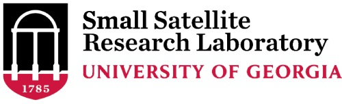

Orbit Mission Control Software
===

This is the Orbit mission control software used to manage missions for the University of Georgia
Small Satellite Research Laboratory. 

This software is a fork of the [Yamcs Mission Control Software](https://yamcs.org/). 

### Contributors
- Conor McFerren
- Andrew Decker
- Tyler Darby